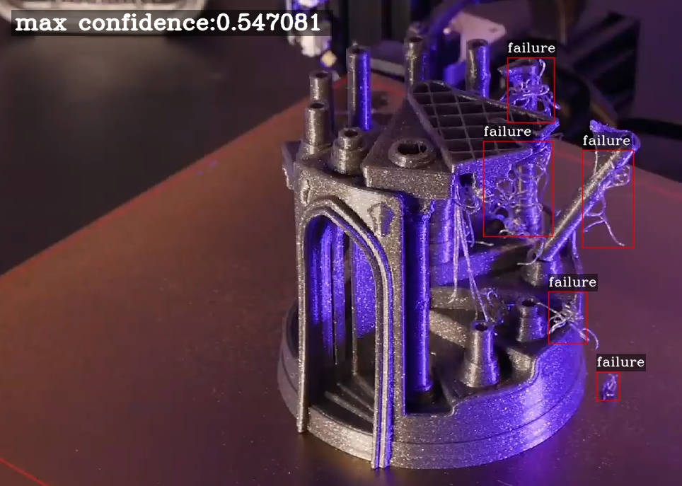

# Nexus AI Server

## 1. What is Nexus AI Server?

Nexus AI Server is a lightweight AI inference server that can be deployed on a local PC.

The purpose of Nexus AI Server development is to make it easier for more detection models to be deployed locally. Users only need to install a binary runner or only a docker to complete everything. Nexus AI Server is mainly for AI application deployment of 3D printers.

If you just want to use Nexus AI directly, please refer to the [Octoprint-Nexus-AI](https://github.com/fiberpunk1/OctoPrint-Nexus-AI)

## 2. Nexus AI Server dependencies

- [Opencv 4.0+](https://opencv.org/)
- [Openvino(optional)](https://github.com/openvinotoolkit/openvino)
- [Yolov4](https://github.com/AlexeyAB/darknet) model(support Yolov2,Yolov3,Yolov4)
- [Mongoose Web Server](https://github.com/cesanta/mongoose)
- [SmtpClient-for-Qt](https://github.com/bluetiger9/SmtpClient-for-Qt)

Related development documents:
- [Nexus AI API](NexusAPI.md)
- [Linux Develop](LinuxDevelop.md)
- [Windows Develop](WindowDevelop.md)

## 3. Todo List

Nexus AI Server currently only has the windows version. The next step is to support the linxu version and create a docker image to facilitate direct use by more linux users.

- [ ] Build docker image
- [ ] Support Yolo4-tiny model
- [ ] Add the UI for replacing the yolov model
- [ ] Add support for GPU
- [ ] Add support for USB/IP Camera 

 
## 4.Community support

- Email: support@fiber-punk.com
- [Website](https://fiber-punk.com/)
- [Facebook](https://www.facebook.com/Fiberpunk-103588222263591)
- [Discord](https://discord.gg/VNNFrfhsbN)

