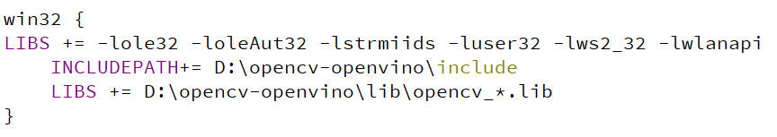

## 1. Development environment setup

- MSVC2017
- Qt5.9.7+
- OpenVinoToolkit

For the installation of openvino toolkit, please refer to this document:[Install OpenVino for Win10](https://docs.openvino.ai/2021.1/openvino_docs_install_guides_installing_openvino_windows.html)

> Before proceeding to the next step, please make sure that the environment variables about OpenVino are set correctly

## 2. Compile Nexus AI Server code

### 1. Compile 
Download Nexus AI Server's source form github:
```
git clone https://github.com/fiberpunk1/NexusAIServer.git
```
After setting up the development environment, you need to change the .pro file of Qt and configure the correct installation paths of OpenVino and OpenCV, as shown in the following figure:



Replace the path after INCLUDEPATH and LIBS with your own installation path

### 2. Execute Program

When running the program, you need to copy all the **dll** files of OpenCV to the compilation directory, and at the same time copy the **dll** related to deployment_tool of openvino to the compilation directory, mainly including:

- tbb.dll  
- inference_engine.dll
- inference_engine_transformations.dll
- ngraph.dll


